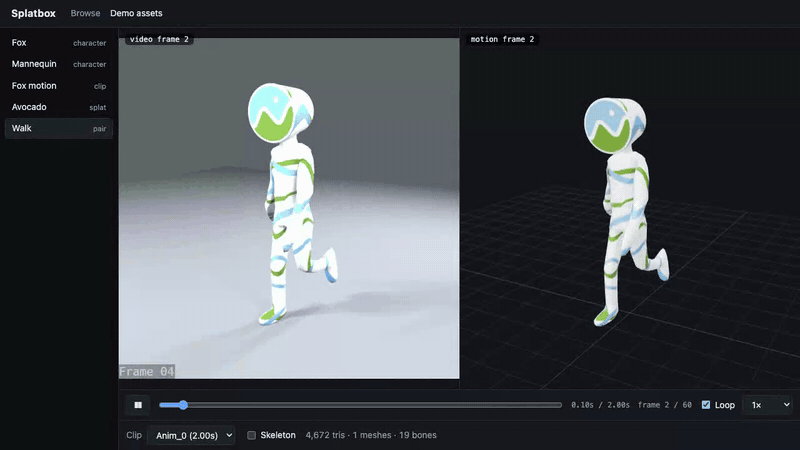
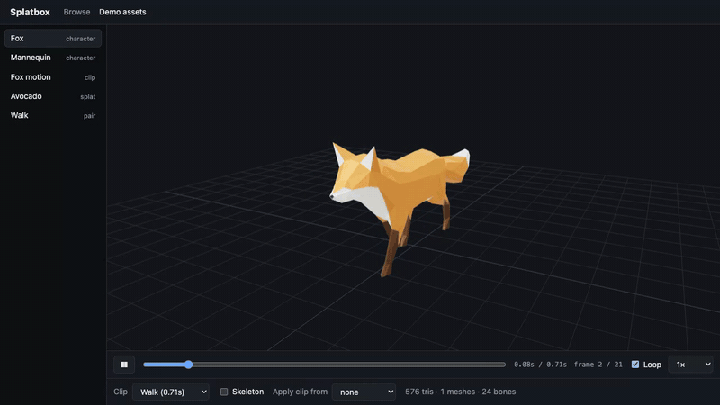
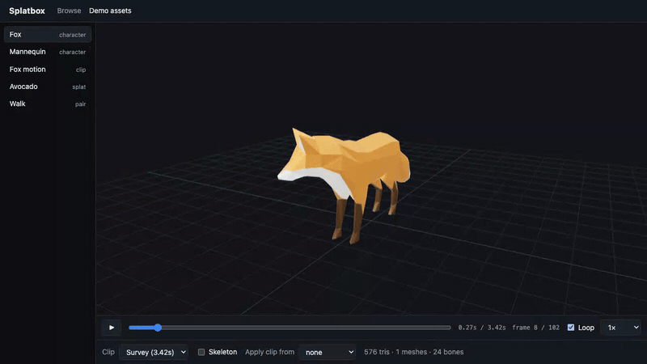
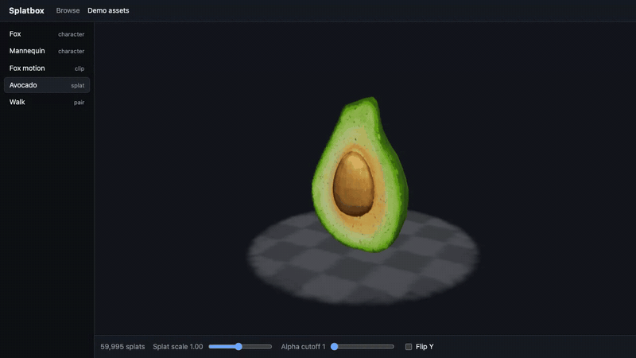
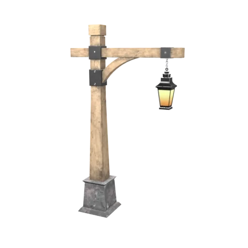
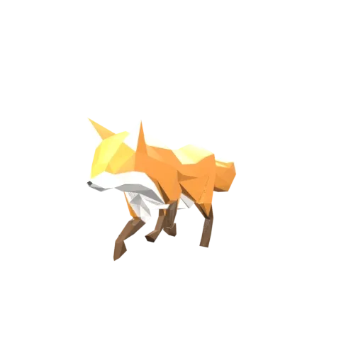
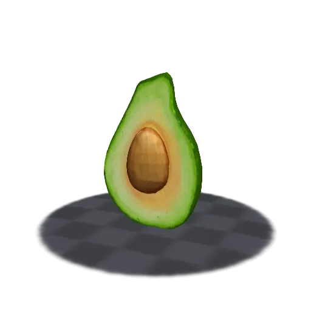
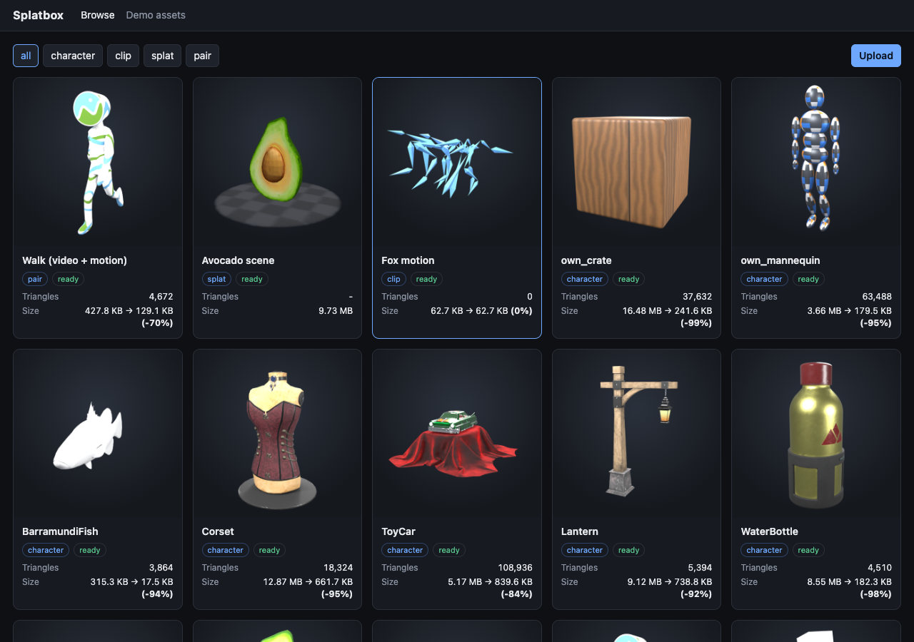
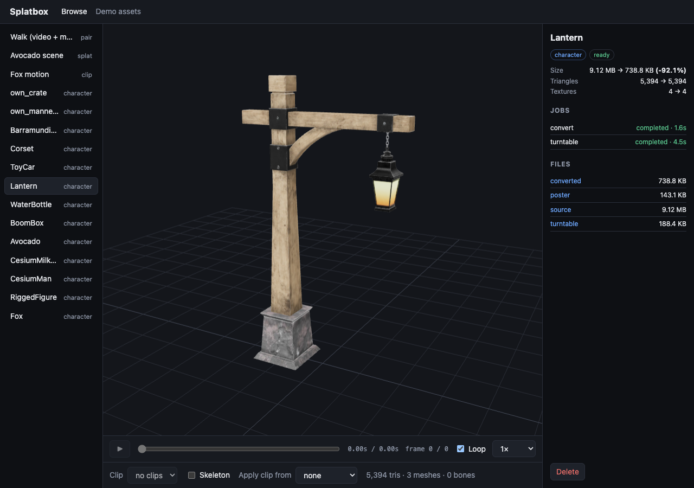

# Splatbox

A 3D asset box. Drop in a character model, an animation clip, a Gaussian splat scene, or a source
video with the motion generated from it, and get:

- a **Three.js previewer** for all four, with timeline scrubbing, a skeleton overlay, and
  side-by-side playback of video and motion on one clock;
- a **converted GLB** (Draco geometry, resized and re-encoded textures) produced by headless
  Blender running under TypeScript workers;
- a **turntable thumbnail** rendered in an asynchronous job and stored in S3 for the browse grid.



Stack: React 18, TypeScript, Vite, three.js, @react-three/fiber, @mkkellogg/gaussian-splats-3d ·
Node 20, Fastify, BullMQ on Redis, SQLite · Blender 4.5 LTS · S3 (MinIO locally) · Docker Compose ·
GitHub Actions.

## The viewer

One persistent canvas; assets are swapped in and out of it and their GPU resources are freed on
every switch.

| Rigged character with skeleton overlay | Clip list and timeline scrubbing |
| --- | --- |
|  |  |
| **Gaussian splat scene** | **Source video beside generated motion** |
|  |  |

- **Characters and clips.** Every `AnimationClip` in the file is listed. Play, pause, loop, speed,
  and a scrubber that sets `mixer.setTime`; time and frame readouts; space and arrow keys. A clip
  from a second GLB can be applied to the open character if its tracks find matching bones
  (the viewer reports how many bound, and refuses a clip that does not fit).
- **Splat scenes.** `.ply`, `.splat` and `.ksplat`, with a splat count, a splat-scale slider, an
  alpha cutoff, and a Y flip for scenes trained from COLMAP poses.
- **Pairs.** A `<video>` on the left and the character on the right, both driven by one
  `SyncClock`. Scrubbing moves both, play and pause are shared, and each pane shows its own frame
  number, read from the video element and from the mixer respectively. The demo video has the
  frame number burnt into the picture, so the match is visible (`Frame 54` above).

The bundled demo assets work without any backend: start the web app and open `#/demo`.

## Conversion: FBX, OBJ and GLB to compact GLB

The worker runs `blender -b --python worker/blender/convert.py -- --in <file> --out <file>.glb
--draco --max-texture 2048` for every uploaded model. `npm run bench` runs the same conversion over
a documented set of 13 assets and writes this table (the copy below is injected from
[docs/conversion_results.md](docs/conversion_results.md)):

<!-- conversion:start -->
**Median size reduction: 94.5%** over 13 assets (92.1% over the 11 third-party assets alone).

| Asset | Content | Before (KB) | After (KB) | Reduction | Triangles | Textures | Convert (s) |
| --- | --- | ---: | ---: | ---: | ---: | ---: | ---: |
| `Fox.glb` | rigged character, 3 clips | 159.0 | 108.3 | 31.9% | 576 | 1 | 0.61 |
| `RiggedFigure.glb` | rigged character, 1 clip, untextured | 48.9 | 25.9 | 47.1% | 256 | 0 | 0.52 |
| `CesiumMan.fbx` | rigged character, 1 clip (FBX, texture embedded) | 544.3 | 137.9 | 74.7% | 4,672 | 1 | 0.62 |
| `CesiumMilkTruck.glb` | node-animated vehicle | 361.3 | 79.8 | 77.9% | 3,624 | 1 | 0.66 |
| `Avocado.glb` | static PBR prop | 7,920.0 | 120.0 | 98.5% | 682 | 3 | 1.12 |
| `BoomBox.glb` | static PBR prop | 10,365.4 | 394.7 | 96.2% | 6,036 | 4 | 1.35 |
| `WaterBottle.glb` | static PBR prop | 8,756.5 | 182.3 | 97.9% | 4,510 | 4 | 1.32 |
| `Lantern.glb` | static PBR prop | 9,340.1 | 738.8 | 92.1% | 5,394 | 4 | 1.49 |
| `ToyCar.glb` | static PBR prop, 109k triangles | 5,295.3 | 839.6 | 84.1% | 108,936 | 8 | 0.97 |
| `Corset.glb` | static PBR prop | 13,175.2 | 661.7 | 95.0% | 18,324 | 3 | 1.37 |
| `BarramundiFish.obj` | static mesh, geometry only (OBJ) | 315.3 | 17.5 | 94.5% | 3,864 | 0 | 0.51 |
| `own_mannequin.glb` | rigged character, 63k triangles, 1 clip | 3,748.7 | 179.5 | 95.2% | 63,488 | 1 | 0.89 |
| `own_crate.glb` | static prop, two 4096 px textures | 16,876.5 | 241.6 | 98.6% | 37,632 | 2 (2 resized) | 1.60 |

Smallest reduction 31.9%, largest 98.6%. Triangle, texture, skin and animation counts are checked to be identical before and after for every asset.

**Settings**

- Geometry: Draco mesh compression (`KHR_draco_mesh_compression`), level 6; quantization bits: position 14, normal 10, texture coordinate 12, colour 10, generic (skin weights) 12.
- Textures: longest side capped at 2048 px; re-encoded as WebP (`EXT_texture_webp`) at quality 75.
- Animations: source keyframes are exported as they are (no per-frame baking); skins are kept.
- Cameras, lights and childless empties are removed.
<!-- conversion:end -->

How to read it: the median is high because most of the set is texture-heavy PBR props, where
PNG to WebP does most of the work. Small rigged characters shrink far less (31.9% and 47.1% here),
because Draco does not touch skin data, animation, or the glTF JSON. The two in-house assets are
synthetic, which is why the median is also given without them.
[samples/README.md](samples/README.md) lists every asset, where it comes from, and its license.

CI re-runs the benchmark on every push and fails if the median falls below
[the committed baseline](docs/conversion_baseline.json), or if any asset loses triangles,
textures, a skin, or an animation.

## Turntables and the browse grid

For every asset the worker renders 24 views 15° apart at 512×512, encodes them as a looping
animated WebP plus a poster PNG, and uploads both to `thumbs/{assetId}/`. Models are rendered by
Blender (EEVEE, three area lights and a camera on a rotating pivot, transparent background).
Splat scenes are rendered by the viewer's own code in headless Chromium, because Blender has no
splat renderer. A motion clip with no mesh is drawn as a stick figure of its joints.

Turntables as the jobs produced them (animated WebP):

| Lantern | Fox | Splat scene (Chromium) |
| --- | --- | --- |
|  |  |  |

The grid shows the poster, swaps in the turntable on hover, and lists kind, triangle count, size
before and after conversion, and job status. Thumbnails load as cards scroll into view.





### Measured times

All 16 sample assets uploaded through the api and processed by one worker
(copied from [docs/pipeline_times.md](docs/pipeline_times.md), written by `scripts/run_pipeline.ts`):

<!-- pipeline:start -->
16 assets uploaded through the api and processed by one worker (concurrency 2): 16 ready, 0 failed, 56 s wall-clock from first upload to last thumbnail.

Times are job durations as recorded by the worker: download from storage, the Blender (or Chromium) run, encoding, and upload.

| Asset | Kind | Status | Convert (s) | Turntable (s) | Turntable renderer | Size |
| --- | --- | --- | ---: | ---: | --- | --- |
| Fox | character | ready | 4.3 | 5.3 | blender BLENDER_EEVEE_NEXT | 159 → 108 KB (-31.9%) |
| RiggedFigure | character | ready | 3.9 | 5.5 | blender BLENDER_EEVEE_NEXT | 49 → 26 KB (-47.1%) |
| CesiumMan | character | ready | 1.3 | 5.0 | blender BLENDER_EEVEE_NEXT | 544 → 138 KB (-74.7%) |
| CesiumMilkTruck | character | ready | 1.3 | 5.0 | blender BLENDER_EEVEE_NEXT | 361 → 80 KB (-77.9%) |
| Avocado | character | ready | 2.2 | 5.1 | blender BLENDER_EEVEE_NEXT | 7920 → 120 KB (-98.5%) |
| BoomBox | character | ready | 3.0 | 4.9 | blender BLENDER_EEVEE_NEXT | 10365 → 395 KB (-96.2%) |
| WaterBottle | character | ready | 2.1 | 4.9 | blender BLENDER_EEVEE_NEXT | 8757 → 182 KB (-97.9%) |
| Lantern | character | ready | 1.9 | 5.0 | blender BLENDER_EEVEE_NEXT | 9340 → 739 KB (-92.1%) |
| ToyCar | character | ready | 1.6 | 5.3 | blender BLENDER_EEVEE_NEXT | 5295 → 840 KB (-84.1%) |
| Corset | character | ready | 3.5 | 4.6 | blender BLENDER_EEVEE_NEXT | 13175 → 662 KB (-95.0%) |
| BarramundiFish | character | ready | 0.7 | 4.2 | blender BLENDER_EEVEE_NEXT | 315 → 17 KB (-94.5%) |
| own_mannequin | character | ready | 1.4 | 4.4 | blender BLENDER_EEVEE_NEXT | 3749 → 180 KB (-95.2%) |
| own_crate | character | ready | 2.3 | 4.8 | blender BLENDER_EEVEE_NEXT | 16876 → 242 KB (-98.6%) |
| Fox motion | clip | ready | 0.7 | 4.1 | blender BLENDER_EEVEE_NEXT | 63 → 63 KB (-0.0%) |
| Avocado scene | splat | ready | - | 3.4 | chromium | - |
| Walk (video + motion) | pair | ready | 1.0 | 4.6 | blender BLENDER_EEVEE_NEXT | 428 → 129 KB (-69.8%) |

Mean convert job 2.1 s; mean turntable job 4.8 s (24 frames at 512×512).

Hardware: Apple M4, 10 cores, darwin arm64. Storage: Amazon S3, bucket "splatbox" in us-east-1. Blender renders with EEVEE on the GPU; splat scenes render in headless Chromium.
<!-- pipeline:end -->

## Architecture

```
browser (React + Three.js) ──► api (Fastify) ──► S3 (uploads, converted GLBs, thumbnails)
            │    ▲                 │
            │    └─ presigned URLs │ BullMQ flow: convert ─► turntable
            └── PUT / GET to S3    ▼
                              Redis ──► worker (TypeScript) ──► blender -b convert.py / turntable.py
                                                            └─► headless Chromium (splat turntables)
```

Uploads go straight from the browser to storage through presigned PUT URLs. On completion the api
enqueues `convert` and `turntable` as a BullMQ flow, so the turntable waits for the converted GLB.
The worker runs Blender headless, uploads the outputs, and updates the asset row; the grid reads
thumbnails through presigned GET URLs. More detail, and the reasoning behind the main decisions,
in [docs/architecture.md](docs/architecture.md).

## Running it

Requirements: Node 20, Docker, and for local development Blender 4.5 LTS.

**Everything in containers**

```bash
docker compose up --build
```

Then open http://localhost:8080. Browsing needs no sign-in; to upload, sign in with the token
from `docker-compose.yml` (`dev-token-change-me-0000`, overridable through `.env`). If a port is
taken, move it with `WEB_PORT`, `API_HOST_PORT`, `MINIO_PORT` or `REDIS_PORT`.

Containers have no GPU, so the worker renders with Mesa's software OpenGL, and the worker image is
`linux/amd64` because Blender only publishes x86-64 Linux builds. On an Apple Silicon Mac that
means emulation on top of software rendering. It works, slowly: measured here, a convert job took
1 to 3 s, an EEVEE turntable 140 s on its own (230 s with two rendering side by side), and a splat
turntable 146 s. `TURNTABLE_ENGINE=workbench` renders a frame in about a second instead, with flat
shading. For day-to-day work on a Mac, run the worker natively (4 to 5 s per turntable):

**Local development**

```bash
cp .env.example .env                 # set BLENDER_BIN if blender is not on PATH
npm install
npx playwright install chromium      # used for splat turntables and the e2e tests
docker compose up -d redis minio
npm run dev:api                      # http://localhost:4000
npm run dev:worker
npm run dev:web                      # http://localhost:5173
```

**Amazon S3 instead of MinIO**

In `.env`, remove `S3_ENDPOINT`, `S3_PUBLIC_ENDPOINT`, `S3_FORCE_PATH_STYLE` and
`S3_CREATE_BUCKET`, set `S3_BUCKET` and `S3_REGION`, and provide `AWS_ACCESS_KEY_ID` and
`AWS_SECRET_ACCESS_KEY`. Browsers upload and download directly, so the bucket needs a CORS rule:

```bash
aws s3api put-bucket-cors --bucket "$S3_BUCKET" --cors-configuration file://docs/s3-cors.json
```

Nothing else changes: the code path is the same AWS SDK calls either way. Under Docker, add the
override file: `docker compose -f docker-compose.yml -f docker-compose.aws.yml up -d`.

**Putting it on a public URL** (a kept-on machine plus a Cloudflare Tunnel, no hosting bill) is
written up in [docs/deploy.md](docs/deploy.md).

**Scripts**

| Command | What it does |
| --- | --- |
| `npm run samples` | Downloads the pinned sample models and derives the rest of the benchmark set (needs Blender) |
| `npm run bench` | Converts the sample set and rewrites `docs/conversion_results.md`; `-- --check` compares with the baseline |
| `npx tsx scripts/run_pipeline.ts` | Uploads the sample set through a running stack and records job times |
| `bash scripts/make_demo.sh` | Rebuilds the demo assets bundled with the web app |
| `npx tsx scripts/capture_readme.ts` | Re-records the GIFs and screenshots above from the running app |

## Tests

```bash
npm test                    # unit tests in shared, api, worker and web
npm run e2e -w web          # Playwright, against the production build
npm run lint && npm run typecheck
```

| Suite | What it covers |
| --- | --- |
| `web/src/viewer/*.test.ts(x)` | The timeline state machine; the sync clock against a fake video and a real `AnimationMixer`; clip matching; clock-driven playback inside the render loop (`@react-three/test-renderer`) |
| `web/e2e/` | Each asset kind loads and draws; scrubbing with the real mouse; skeleton overlay; external clips; pair sync; 50 asset switches with `renderer.info.memory` unchanged; an opt-in frame-rate measurement |
| `api/test/` | Routes through supertest against real MinIO and Redis: open reads and token-gated writes, presigned PUT and GET round trips, validation, pagination, the convert/turntable flow, failed jobs, delete |
| `worker/test/` | Job handlers with Blender mocked (24 frames rendered, outputs uploaded, rows updated); the processor's retry bookkeeping; and real Blender converting a rigged GLB |
| `shared/test/` | The SQLite store and the GLB inspector |

`api` tests need `docker compose up -d redis minio`. The real-Blender suite skips itself when
Blender is not installed, except in CI, where `REQUIRE_BLENDER=1` makes that a failure.

CI (`.github/workflows/ci.yml`) runs lint, typecheck, all unit and api tests, the Blender
integration test, the conversion benchmark against the baseline, and the viewer e2e suite.

## Measurements

Measured on an Apple M4 (10 cores, 24 GB), macOS 26.6, Blender 4.5.14 LTS, Chromium 153.

| What | Result | How |
| --- | --- | --- |
| Median GLB size reduction | **94.5%** over 13 assets; 92.1% over the 11 third-party ones | `npm run bench` |
| Pair sync, per rendered frame | `video.currentTime` vs `mixer.time` over 150 frames of playback: worst frame 0.5 to 1.2 ms across four runs, mean 0.3 to 0.7 ms (tolerance: 33.3 ms, one frame at 30 fps) | `web/e2e/pair.spec.ts` |
| Pair sync, against the frame on screen | pose vs the presentation timestamp of the displayed video frame: mean 25 to 36 ms, worst 36 to 38 ms across the same runs | same test, `requestVideoFrameCallback` |
| Frame rate, 63,488-triangle skinned character playing | 60.2 fps, 95th-percentile frame 16.7 ms (display-capped) | `PERF=1 npx playwright test perf` |
| Renderer memory across 50 asset switches | geometries 2, textures 3 after every cycle | `web/e2e/memory.spec.ts` |
| Convert job | about 1 s per asset | `scripts/run_pipeline.ts` |
| Turntable job | about 4 to 5 s per asset in Blender; 2.5 s for a 150k-splat scene in Chromium | `scripts/run_pipeline.ts` |
| Frame rate with the CPU throttled 4x | 60.2 fps (the GPU is not throttled) | same perf test |

The second sync row is the honest caveat to the first. `currentTime` is a continuous clock that
runs ahead of the frame currently displayed, so although the two clocks agree to about a
millisecond, the pose leads the picture on screen by roughly one video frame. Posing from
`requestVideoFrameCallback`'s media time instead would close that gap at the cost of the first
number; that trade has not been made.

## Limitations

- **Blender cannot render Gaussian splats.** Splat turntables are rendered in headless Chromium
  with the web viewer's code. Without a GPU that falls back to software WebGL, which is much
  slower (75 s instead of 2.5 s for the 150k-splat sample on this machine).
- **Draco is lossy.** Positions are quantized to 14 bits, normals to 10, texture coordinates to
  12, skin weights to 12. That is invisible at preview scale but it is not a round trip; keep the
  original for anything that needs exact geometry. Vertex order also changes.
- **Textures are re-encoded lossy** (WebP, quality 75) and capped at 2048 px. Converted files need
  a loader that supports `EXT_texture_webp` (three.js and Blender do). Single-channel textures stay
  PNG, because Blender cannot write them as WebP.
- **What survives a trip through Blender** is what Blender's glTF importer and exporter
  understand: meshes, PBR materials, skins, and keyframed animation. Clips come back in
  alphabetical order. Extensions Blender does not model, and custom extras, are dropped.
- **Formats.** Models: `.glb`, `.gltf` (self-contained), `.fbx`, `.obj` as a single file, so no
  external `.bin`, `.mtl`, or texture files. Splats: `.ply`, `.splat`, `.ksplat`. Video:
  `.mp4`, `.webm`, `.mov`, whatever the browser can decode.
- **Frame numbers assume 30 fps.** glTF stores keyframe times in seconds and no frame rate.
- **The sample splat scene is synthesized** from a mesh by `scripts/make_splat.ts`, not captured.
  It is a valid splat file in both layouts, without view-dependent colour.
- **Single host.** The api and the worker share one SQLite file. Auth is one shared token:
  anyone can browse and view; the token is needed to upload, retry or delete.
- **Node 20** is what the spec pins and what everything here is tested on. It is past its
  end-of-life date: the AWS SDK will require Node 22 from January 2027, and `better-sqlite3` is
  pinned to 12.8.0 because later releases no longer ship Node 20 binaries.
- **Uploads are single-part** presigned PUTs, so one object is limited to 5 GB.

## Not built yet

- A hosted demo.
- Importing a Rigforge output directly from its asset URL.
- An export menu (FBX and USDZ through Blender, share links).
- An original-versus-converted comparison view.
- KTX2/Basis textures as a second compression profile.

## How this was built

Feature by feature in the order of the list at the top, with each piece reviewed and tested
before the next: unit tests first for the logic that can be isolated (the timeline reducer, the
clock, job handlers), then the real thing end to end (real Blender, real MinIO and Redis, a real
browser). The measurements above come from scripts in this repository, and so does every image.

Mistakes that the tests and the benchmark caught along the way:

1. **Two textures silently lost in conversion.** The first version of `convert.py` asked
   Blender's exporter to write every texture as WebP. Blender cannot encode single-channel images
   as WebP; it logged an error, dropped the clearcoat and occlusion textures of `ToyCar`, and
   exited 0 with a smaller file. The benchmark's integrity check (texture count before and after)
   failed, which is how it surfaced. `convert.py` now encodes textures one at a time, keeps the
   original when the target format fails or is not smaller, and the reported reduction for that
   asset went from a wrong 88.0% to a correct 84.1%.
2. **Animated files barely shrank, and clips changed length.** The exporter's default bakes a key
   on every frame for every bone. That inflated animation data enough that `Fox.glb` came out
   3% smaller instead of 32%, and resampling a 24 fps clip at 30 fps shortened it by a fraction
   of a frame. The before/after inspection showed both; the exporter now writes the source
   keyframes as they are.
3. **A GPU leak in the splat path.** The first run of the 50-switch memory test showed one
   geometry and one texture left behind per splat scene. The splat library's `dispose()` misses a
   helper mesh and a placeholder texture it creates; `disposeSplatViewer` now frees both.
4. **Frame readout off by one.** After seeking to frame 37, the video pane showed 36. A video
   element reports its time truncated to the microsecond (1.233333), which floored to the previous
   frame. The pair test caught it; `frameAt` now allows a thousandth of a frame of slack.
5. **Splat scenes failed to load from storage.** The splat library picks a parser from the end of
   the URL, and a presigned URL ends in a signature, not `.ply`. The format is now passed
   explicitly from the uploaded filename.

## Repository layout

```
web/        React + Vite app; src/viewer/ is the previewer, e2e/ the Playwright tests
api/        Fastify api: assets, presigned URLs, job queueing
worker/     BullMQ worker; blender/convert.py and blender/turntable.py run inside Blender
shared/     config, SQLite store, S3 wrapper, queue definitions, GLB inspector
samples/    manifest and license notes for the benchmark set (assets are fetched, not committed)
scripts/    bench_convert.ts, make_samples.sh, run_pipeline.ts, and the asset builders
docs/       conversion_results.md, pipeline_times.md, architecture.md, thumbnails, images
```

## Credits

Sample models are from [KhronosGroup/glTF-Sample-Assets](https://github.com/KhronosGroup/glTF-Sample-Assets):
Fox (CC0 model by PixelMannen; CC BY 4.0 rig and animation by tomkranis, glTF conversion by
@AsoboStudio and @scurest), Cesium Man, Rigged Figure and Cesium Milk Truck (CC BY 4.0, © Cesium),
and CC0 props by Microsoft and others. Full list with licenses in
[samples/README.md](samples/README.md) and [web/public/demo/README.md](web/public/demo/README.md).
